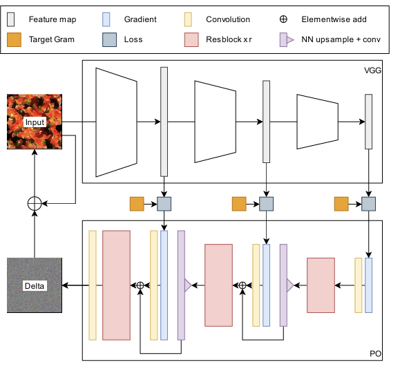
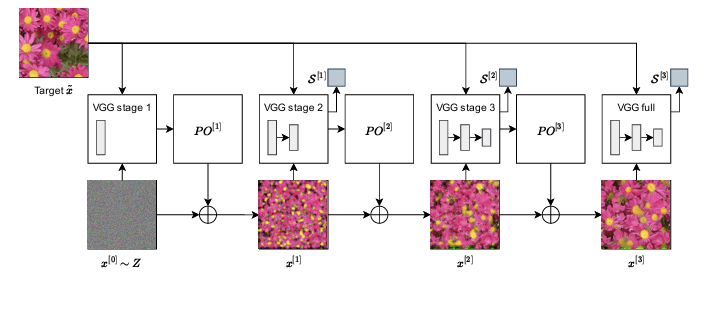
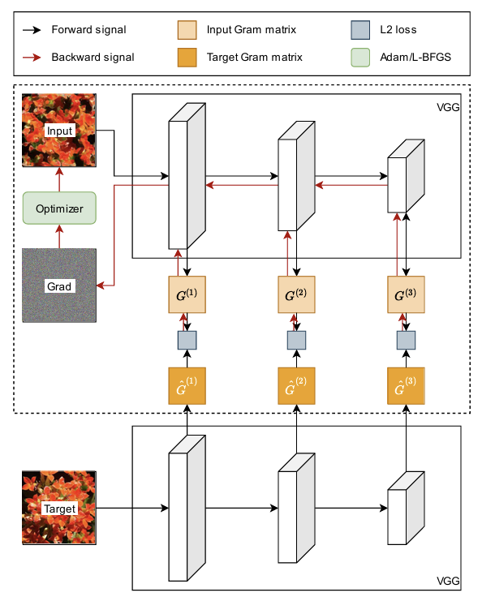

# Fast Texture Synthesis via Pseudo-Optimizer

## Introduction

This project proposes a **fast texture synthesis** method using a **pseudo-optimizer**. The goal is to generate high-quality textures efficiently by leveraging optimization techniques to accelerate the synthesis process. This approach is particularly useful in fields where the rapid generation of realistic textures is crucial, such as video games, virtual reality, and simulation.

## Prerequisites

Make sure you have the following dependencies installed:

- Python 3.8.10
- NumPy
- scikit-image
- Matplotlib
- Pillow

To install the dependencies, run:

```bash
pip install -r requirements.txt
```
## Pseudo Optimizer Architectures Overview

### The Classic Pseudo Optimizer

The proposed method relies on using a **pseudo-optimizer** for texture synthesis. Unlike traditional approaches based on costly iterative optimizations, this method employs an efficient approximation that reduces computation time while maintaining high texture quality.



#### Key Features:

- **Efficiency**: Significant reduction in computation time compared to traditional methods.
- **High Quality**: Generation of realistic textures with high fidelity to input examples.
- **Flexibility**: Applicable to various types of textures and adaptable to different use cases.

#### Why This Approach Works:

- **Efficient Approximation**: The use of a pseudo-optimizer allows approximation of optimal solutions without requiring intensive computations.
- **Contextual Information Utilization**: The method exploits contextual image information to generate coherent and realistic textures.

### The Adaptive Pseudo Optimizer

The **Adaptive Pseudo Optimizer** builds upon the classic version by dynamically adjusting its parameters based on the complexity of the texture. This improves the adaptability of the model, leading to better generalization across different types of textures.

#### Key Features:
- **Dynamic Adaptation**: Automatically adjusts optimization parameters to better fit diverse texture structures.
- **Improved Convergence**: Faster convergence for complex textures without sacrificing quality.
- **Robustness**: More stable results across a wide range of input images.

#### Why It Works:
- **Self-Tuning Mechanism**: The optimizer adjusts its learning strategy based on real-time texture feedback.
- **Better Feature Extraction**: More accurate texture representation due to enhanced parameter tuning.

### The Progressive Pseudo Optimizer

The **Progressive Pseudo Optimizer** takes the adaptive approach further by introducing a multi-stage refinement process, progressively enhancing texture quality.



#### Key Features:
- **Multi-Stage Optimization**: Improves texture details iteratively for higher fidelity.
- **Fine-Grained Control**: Allows more precise adjustments at each stage.
- **Enhanced Realism**: Generates more natural-looking textures compared to other methods.

#### Why It Works:
- **Stepwise Refinement**: Each optimization stage focuses on progressively improving specific aspects of the texture.
- **Better Feature Hierarchies**: Extracts and refines texture details in a structured manner.

## The Gatys and Al Algorithm

The **Gatys and Al Algorithm** is a pioneering method in neural style transfer and texture synthesis. It utilizes a **pre-trained VGG network** to extract feature representations of images and then optimizes a noise image to match the statistics of a reference texture.




#### Key Features:
- **Neural-Based Approach**: Uses deep learning for high-quality texture generation.
- **Gram Matrix Representation**: Captures the style and texture of an image through feature correlations.
- **High Visual Fidelity**: Produces textures with intricate details similar to the input example.

#### Why It Works:
- **Feature Space Manipulation**: Controls the balance between content and style information.
- **Deep Feature Extraction**: Leverages a powerful pre-trained network to encode texture information effectively.

## Usage

### Training the Models and Synthesize
To train the **Gatys and Al Algorithm**, run:

```
python -c "from synthesize import Gatys_and_alSynthesize; Gatys_and_alSynthesize('path/to/texture.jpg', 'path/to/output.jpg', 300, 'cuda')"
```

To train the **Classic Pseudo Optimizer**, run:

```
python -c "from synthesize import Pseudo_optimizerSynthesize; Pseudo_optimizerSynthesize('path/to/texture.jpg')"
```

To train the **Adaptive Pseudo Optimizer**, run:

```bash
python -c "from synthesize import Adaptive_Pseudo_Optimizer; Adaptive_Pseudo_Optimizer(['path/to/texture1.jpg', 'path/to/texture2.jpg'])"
```

To train the **Progressive Pseudo Optimizer**, run:

```
python -c "from synthesize import Progressive_Pseudo_Optimizer; Progressive_Pseudo_Optimizer(['path/to/texture1.jpg', 'path/to/texture2.jpg'])"
```

#### Loss Function

The model is trained by minimizing a loss function that evaluates the difference between the generated texture and the input sample. The Adam optimizer is used to adjust the model weights with a learning rate tuned for stable convergence for the optimizer models and the LBFGS optimizer is used for the Gatys and Al algorithm.

### Evaluation

To evaluate the model on a dataset, use the following script:

```
python evaluate.py --model_path path_to_your_model.pt --data_dir input_textures --device ("cpu" or "cuda") --batch_size 8
```

## Results

The performance of the pseudo-optimizer-based texture synthesis method was evaluated in terms of visual quality and diversity. To do so, we used the average texture loss and the average diversity loss.

| Metric                | Gatys and Al        | Classic Pseudo Optimizer| 
| --------------------- | ------------------ |------------------ |
| Average Texture loss        | 4.35          | 6.26 |
| Average Diversity loss |6.1x10^6             | 4.3x10^6|

Here are some examples of generated textures:


## Acknowledgements

This project was developed as part of the Computational Imaging course at IMT Atlantique, supervised by Daniel-Zhu.

## Authors

- **Skander MAHJOUB**, email: skander.mahjoub@imt-atlantique.net
- **Océane DU LAURENT DE LA BARRE**, email: oceane.du-laurent-de-la-barre@imt-atlantique.net
- **Bao Chau TRAN**,email: bao-chau.tran@imt-atlantique.net
